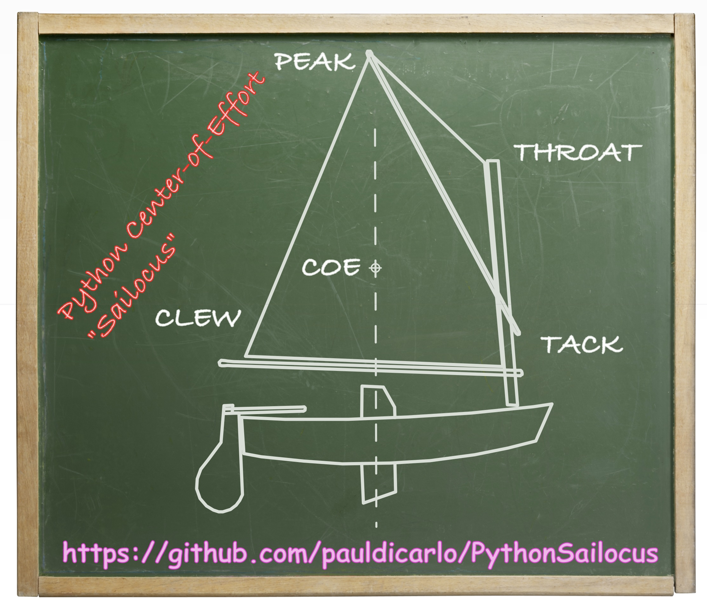
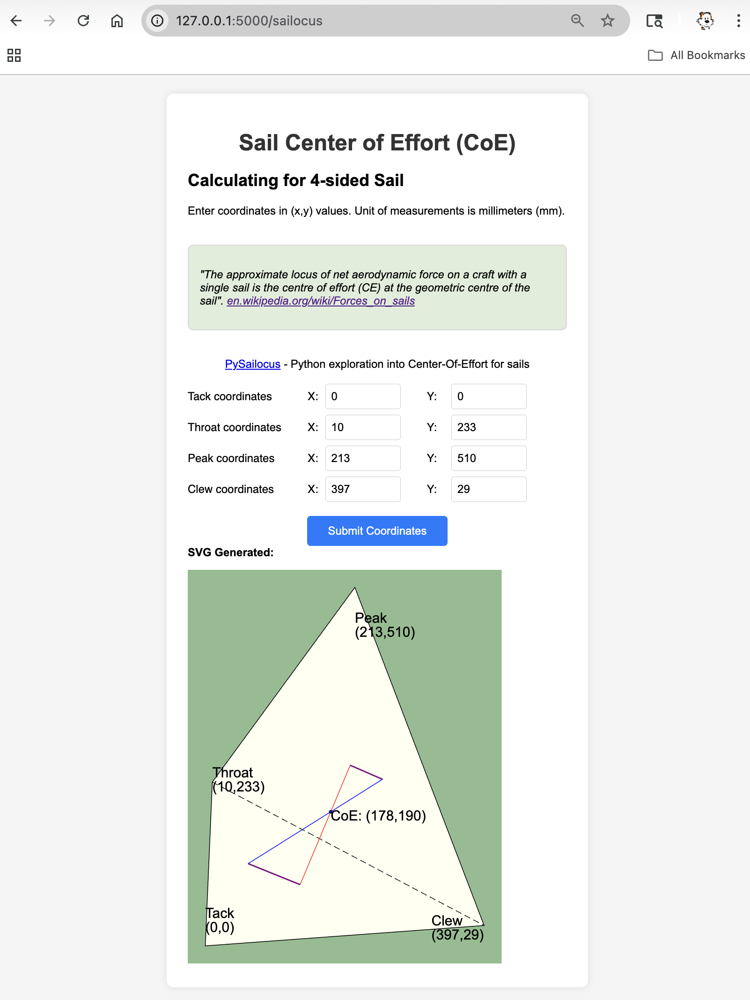

# Python Sailocus (Center-of-Effort)
paul.dicarlo@gmail.com



Blog: https://sailocus.blogspot.com/ 

The purpose of this project is to explore creation of REST APIs and Python.
The intent is to provide APIs (and a web app) that allows for creation of sail geometries and calculation of the sail's Center of Effort (CoE).

> "_the approximate **locu**s of net aerodynamic force on a craft with a single **sail** is the centre of effort (ce) at the geometric centre of the sail_". https://en.wikipedia.org/wiki/Forces_on_sails

### Background
Sailocus is an attempt to write code that will explore the aerodynamic forces on sails. It is meant to be a development exercise to build my proficiency in some new programming languages... as well as better understand forces on sails... and maybe even design my own sails someday.

### The Name Sailocus
The name Sailocus comes from "sail" and "locus" (see quote above)

### Simple Example
```python
from sailocus.sail import sail
from sailocus.geometry import point
from sailocus.svg import svg

# we're making a 4-sided sail here so we need
# to have the peak, throat, take, and clew...
# Point(x,y) where x/y are millimeters and ints
peak = point.Point(213, 510)
throat = point.Point(10, 233)
tack = point.Point(0, 0) 
clew = point.Point(397, 29) 

# create a Sail with the points
xsail = sail.Sail(tack=tack, clew=clew, head=None, peak=peak, throat=throat, sail_name = "Four sided sail")
xsail.validateSail()
print(f"CoE={xsail.coe}")

# Create SVG file of sail and its CoE
xsvg = svg.SVG()
pathToFile = "./simpleSailFromClass.svg"
off_set = point.Point(25,25)
xsvg.createSailSVG(xsail, pathToFile, True, off_set)
```

### Caveat
You should only use sails designed and made by a professional. This code is just for a learning excercise.

## Project Todos
Future thigns ao add to this project
* Improve math/geometry code, handle edge conditions, etc
* JWT tokens for Rest APIs (just to have them)
* Hook up database, allow logins and ability to save/modify/delete sails in db
* Login/create login pages
* Group of premade dimensions for common sails (later in db) 

# Setting up environment
```bash
python3 -m venv .venv 
source .venv/bin/activate
pip3 install  -r requirements.txt
```

# Saving the environment
* pip3 freeze > requirements.txt

# Testing
```bash
python3 -m pytest
mypy .
```


# Main modules:
* `main.py` - simple.  Uses PyQt5 to display SVG of COE of simple sail.
* `main_fastapi.py` - Use a URL similar to http://127.0.0.1:8000/sailocus/api/v1/coe/ 
    * And to get the Swagger docs:  http://127.0.0.1:8000/docs 
    * sample script to invoke [post_request_create_svg_fastapi.sh](./scripts/post_request_create_svg_fastapi.sh)
    * for the FastAPI web app:  http://localhost:8000/sailocus/api/v1/sailocus/
* `main_flask.py` - **DEPRECATED**. Use a URL similar to http://127.0.0.1:5000/sailocus to get a simple form that takes sail coordinates for a 4-sided sail, calculates the CoE, and then displays an SVG of the sail/CoE. 
    * sample script to invoke [post_request_create_svg_flask.sh](./scripts/post_request_create_svg_flask.sh)
    * for the Flask web app:  http://127.0.0.1:5000/sailocus
# Sample HTML 
Screen grab of first time getting simple code path to work for a web interface to generate the Center of Effort (CoE).



